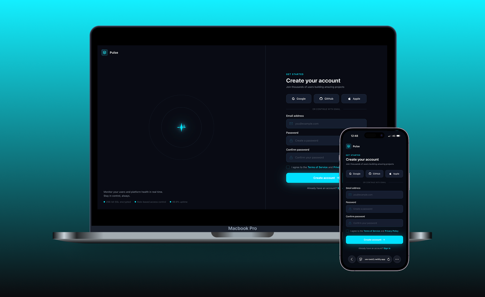

# Pulse

A small user management dashboard built with Vue 3 and TypeScript.

## What it does

Lets you view and manage a list of users — see who's active, who's logged in,
browse individual profiles, and check basic stats. There's also a simple auth
flow (sign in, sign up, forgot password) though it's mostly UI for now.

## Stack

- Vue 3 + TypeScript (Composition API)
- Vue Router
- Pinia
- Vite

## Project structure

- `components/ui` — reusable base components (BaseInput, BaseButton, BaseIcon, etc.)
- `components/auth` — auth layout and OAuth buttons
- `components/layout` — top bar and app container
- `components/dashboard` — dashboard panel
- `components/user` — user table, profile card, stat cards, account details
- `views` — auth pages, dashboard, users list and user detail
- `composables` — useUsers for fetching/managing user data
- `stores` — auth state via Pinia

## Notes

- All icons are handled through a single `BaseIcon` component registered globally
- Each component and view has its own co-located CSS file kept alongside it
- CSS is scoped per component
- Content is capped at `max-width: 1600px` to keep things sane on large screens
